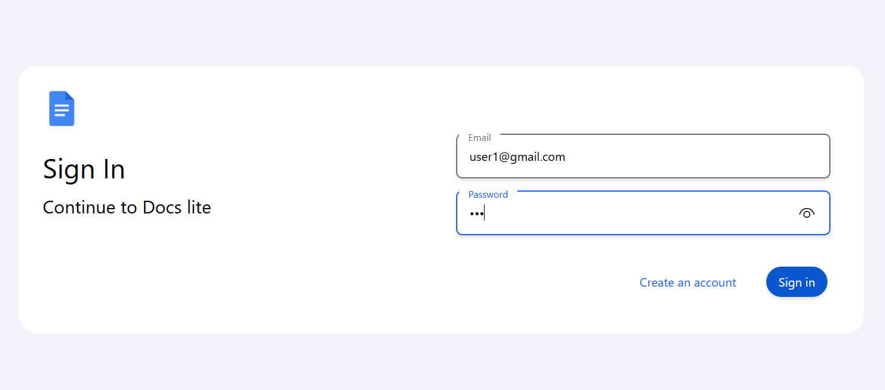
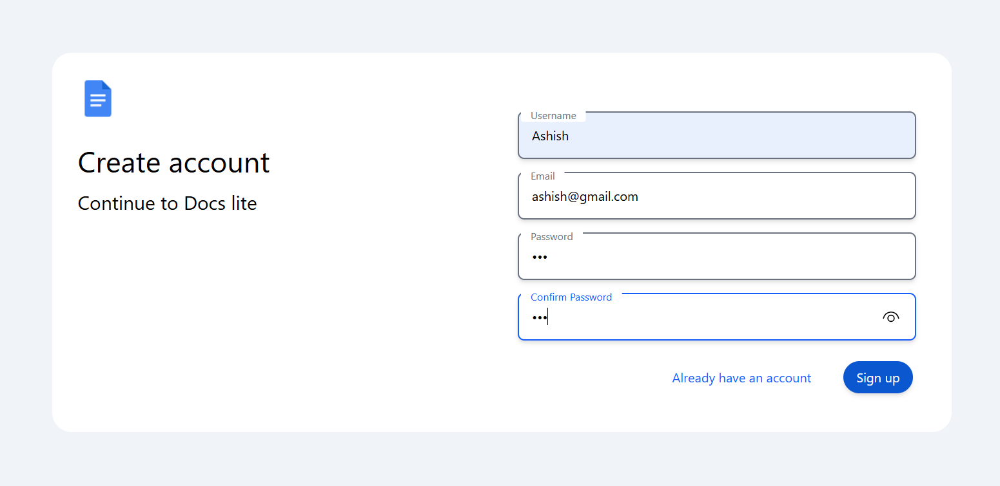
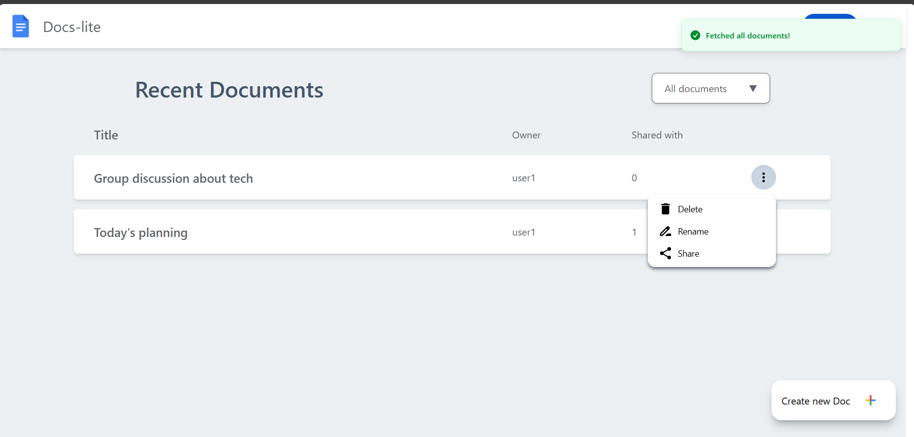
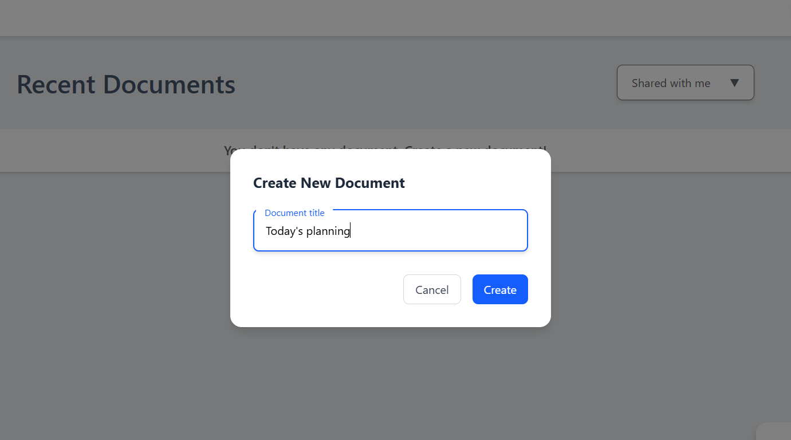
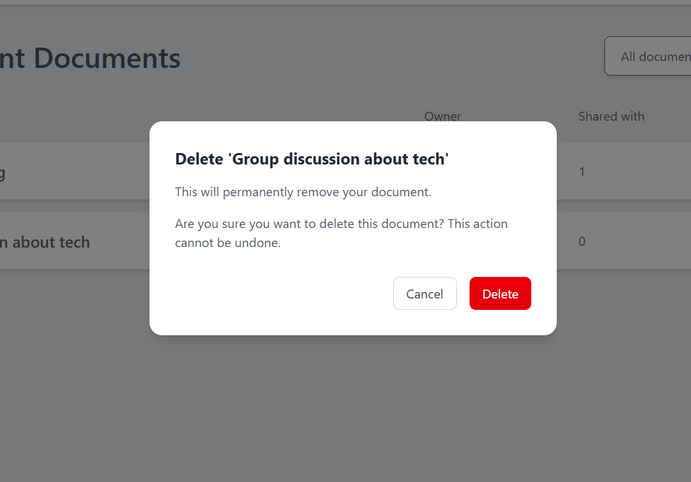
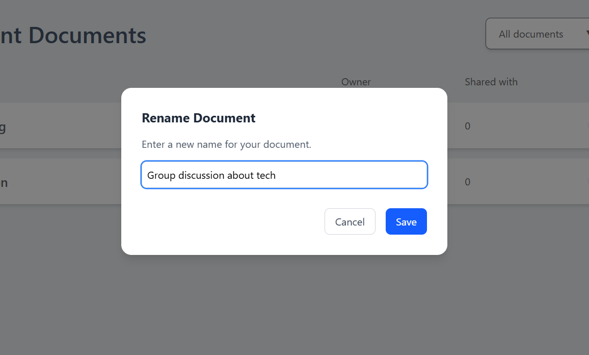
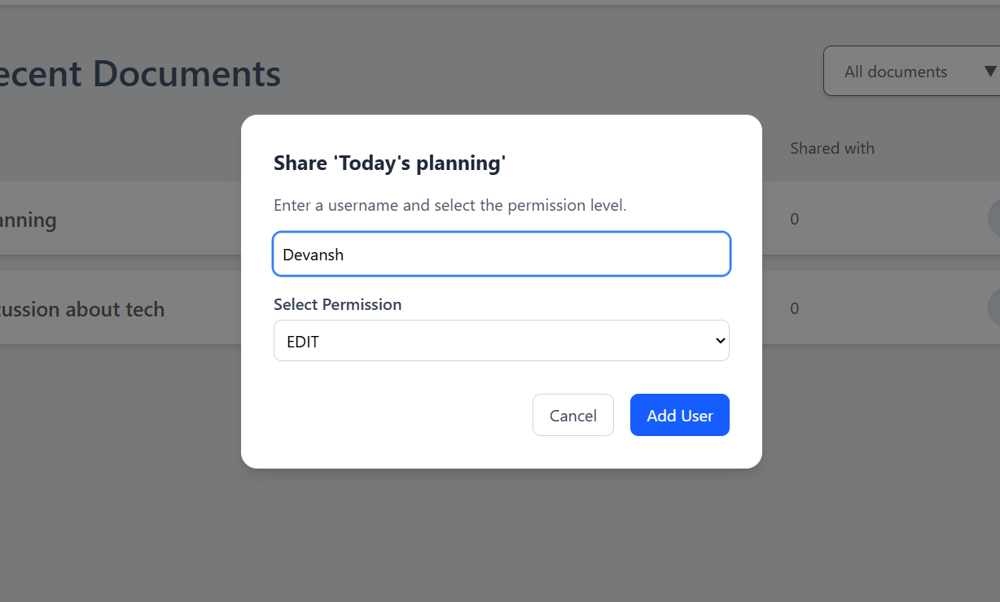
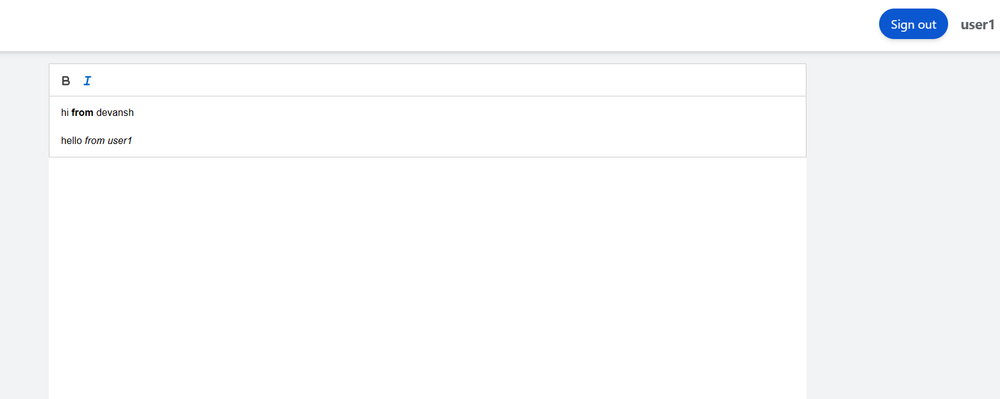
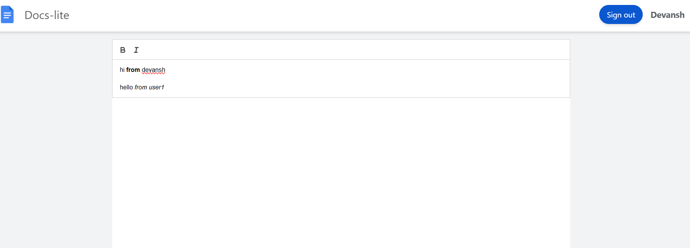

# Collaborative Document Editor

A real-time collaborative text editor in the style of Google Docs. Multiple users can edit the same document simultaneously. Conflicts are resolved automatically using a CRDT (Conflict-free Replicated Data Type), so no edit is ever lost.

---

## How it works

Each character in a document is a node in a doubly-linked list with a globally unique ID in the format `counter@username` (e.g. `3@alice`). When two users type at the same position at the same time, a deterministic tie-breaking rule based on the username ensures every client reaches the same document state without a central coordinator. Deleted characters are tombstoned rather than removed, preserving structural anchors for concurrent inserts.

Changes are broadcast in real time over WebSockets using the STOMP protocol. A polling fallback runs every two seconds to catch any messages that were missed during reconnects.

---

## Features

- Real-time collaboration — multiple users, same document, no conflicts
- Rich text formatting — bold, italic, underline, strikethrough, headings, lists, alignment, indentation, text color, highlight
- Live cursors — see where other users are typing
- Active user list — avatars update as people join and leave
- Save — manual save button (Ctrl+S) and automatic save every 30 seconds
- Authentication — register, login, JWT-based sessions, optional two-factor authentication via email OTP
- Document sharing — share with specific users, assign read or edit permissions
- Google Docs-style UI — sticky toolbar, page-style editor, document dashboard

---

## Tech stack

| Layer | Technology |
|---|---|
| Frontend | React 19, Quill.js, TailwindCSS, Redux |
| Backend | Java 17, Spring Boot 3.2, Spring Security |
| Real-time | STOMP over WebSocket |
| Database | PostgreSQL 14+ |
| Auth | JWT (HS256), BCrypt, email OTP |
| Container | Docker, docker-compose |

---

## Running locally

There are two ways to run the project on your own machine.

---

### Option A — Docker Compose (recommended, no installs needed)

The only prerequisite is [Docker Desktop](https://www.docker.com/products/docker-desktop/).

```bash
git clone https://github.com/BasistthaSanjayKumar-ds/Collaborative-text-editor
cd Collaborative-text-editor

cp .env.example .env
```

Open `.env` and set at minimum:

```dotenv
POSTGRES_PASSWORD=any_password_you_like
JWT_SECRET=<output of: openssl rand -base64 64>
```

Then start everything:

```bash
docker compose up --build
```

Open **http://localhost:3000** in your browser. All API calls and WebSocket
traffic are proxied through nginx — the backend is not exposed directly.

To stop:

```bash
docker compose down        # stop containers, keep the database
docker compose down -v     # stop containers AND delete the database
```

> **Note:** `VITE_API_URL` and `VITE_WS_URL` are baked into the JavaScript
> bundle at build time. If you change them in `.env` you must rebuild:
> `docker compose up --build`.

---

### Option B — Run services individually (for development / debugging)

Use this if you want hot-reload on the frontend or to run the backend in your
IDE with a debugger attached.

**Prerequisites:** Node.js 18+, Java 17+, PostgreSQL 14+

#### 1. Clone

```bash
git clone https://github.com/BasistthaSanjayKumar-ds/Collaborative-text-editor
cd Collaborative-text-editor
```

#### 2. Create the database

```sql
CREATE DATABASE collabdocs;
```

#### 3. Configure the backend

```bash
cp backend/src/main/resources/application-sample.yml \
   backend/src/main/resources/application.yml
```

Open `application.yml` and fill in your database password and a JWT secret:

```yaml
spring:
  datasource:
    password: your_postgres_password

application:
  security:
    jwt:
      secret-key: <output of: openssl rand -base64 64>
```

#### 4. Start the backend

```bash
cd backend
./mvnw spring-boot:run
```

Runs on **http://localhost:8080**

#### 5. Start the frontend

```bash
cd frontend
npm install
npm run dev
```

Runs on **http://localhost:5173**

The Vite dev server talks directly to the backend at `localhost:8080` (the
`config.js` fallback kicks in automatically when no build-time env var is set).

#### 6. Open the app

Go to **http://localhost:5173**, register an account, create a document, and
share the URL with a collaborator.

---

## Project structure

```
backend/src/main/java/com/basisttha/
  engine/          CRDT data structure and lifecycle manager
  controller/      REST endpoints and WebSocket message handlers
  security/        JWT authentication, Spring Security config
  service/         Business logic — documents, authorization
  model/           JPA entities (User, Doc, UserDoc)
  event/           WebSocket connect/disconnect lifecycle
  exception/       Global exception handler

frontend/src/
  pages/Edit.jsx   Collaborative editor — CRDT client, STOMP sync
  pages/View.jsx   Document dashboard
  pages/Auth.jsx   Login and registration
  Redux/           Auth and document state management
  components/      Navbar, document list row, modals
```

---

## Screenshots

**Sign in and sign up**




**Document dashboard**



**Document management**






**Collaborative editing**




---

## Research basis

The CRDT algorithm is based on YATA (Yet Another Transformation Approach), the same algorithm used by Yjs. See the included research paper for background:

> Shapiro et al., *A Survey of CRDTs for Real-Time Collaborative Editing* — [CRDT_Research_Paper.pdf](./CRDT_Research_Paper.pdf)

---

## License

MIT
